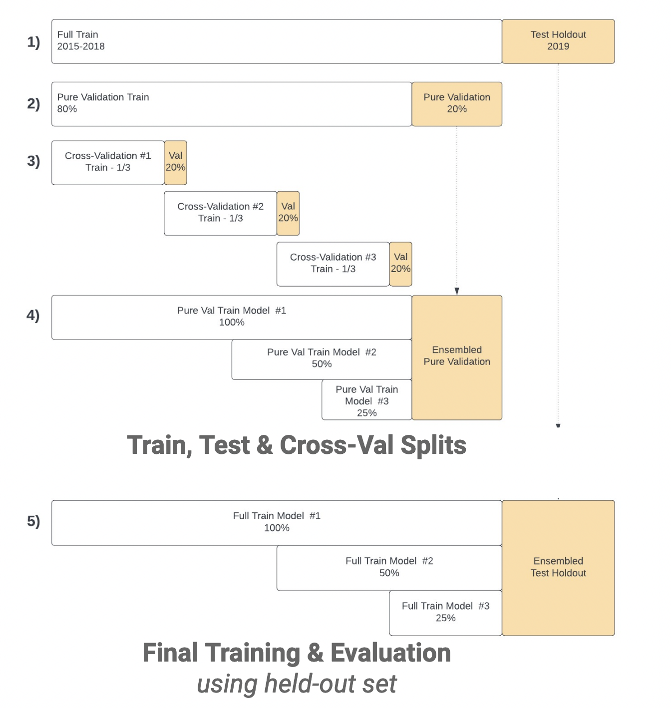
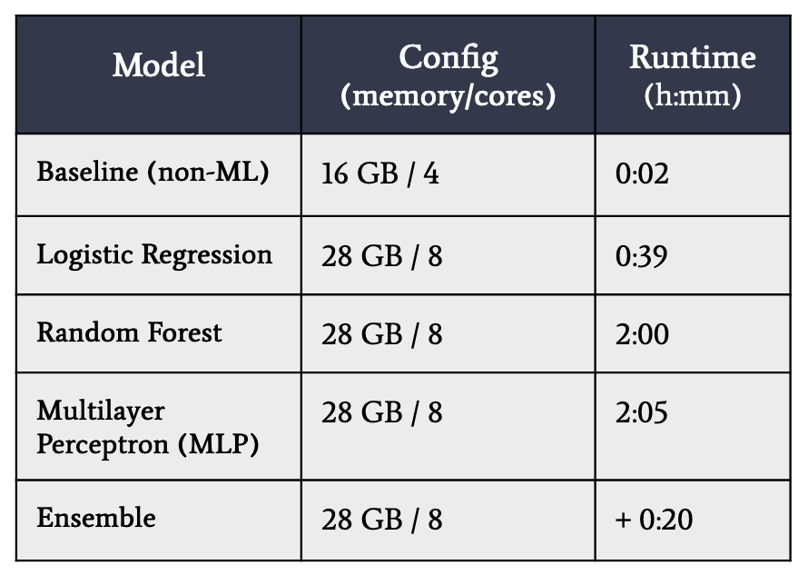
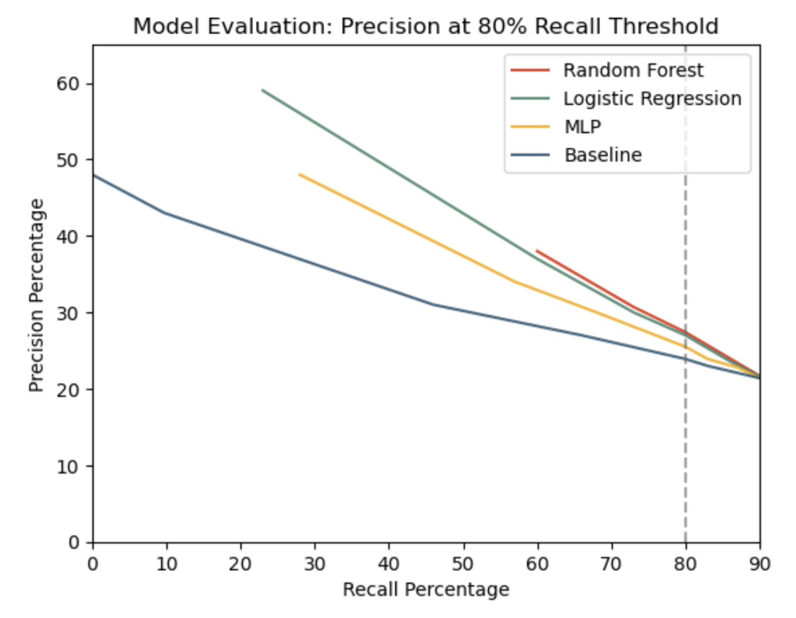
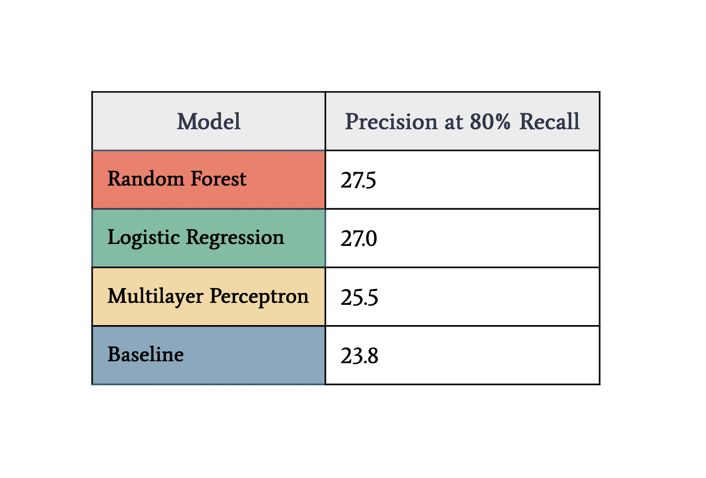

## Machine Learning at Scale: Flight Delay Prediction
 

### Overview
**Can we predict which flights will be delayed two hours before their scheduled departure times?**
 
 
This Machine Learning at Scale team project used Spark, Databricks, and 5 years of U.S. domestic flight and weather data to predict flight delays of at least 15 minutes at 2 hours prior their scheduled departures.
 
Our objectives in this project were to: 
1. Develop machine learning models that can predict 15+ minute delays within 2 hours of departure with at least 20% precision at an 80% recall threshold 
2. Identify key factors in flight delays for future model development and client insights 
 
 

### Background
Optimization strategies for mitigating flight delays are crucial to the airline industry: timely flight performance is a key competitive factor, as high volumes of delayed flights increase operational costs and reduce customer satisfaction. On average, over 20% of U.S. flights are delayed by at least 15 minutes, translating to billions of dollars in costs for airlines [1].

[National Oceanic and Atmospheric Administration NCEI](https://www.ncei.noaa.gov/products/land-based-station/local-climatological-data).
 At an estimated cost of $101.18 per minute of delay in aircraft block flight time, longer delays mean exacerbated costs [2]. Actionable predictions and insights into the sources of delays can empower proactive, data-driven strategies to minimize the disruptions caused by delays, yielding improved customer satisfaction and reduced operational costs.
 
 

### Data Overview
Flight data was sourced from the [Transtats Database](https://www.transtats.bts.gov/Fields.asp?gnoyr_VQ=FGJ) maintained by the U.S. Department of Transportation. The full dataset contains on-time performance data for 31,746,841 U.S. passenger flights between 2015 and 2021, with 109 total features. Key variables in EDA and modeling included flight and carrier (airline) identifiers, airport location information, and delay time and source attributes. 
 
 
Weather data was sourced from the [National Oceanic and Atmospheric Administration NCEI](https://www.ncei.noaa.gov/products/land-based-station/local-climatological-data). This data consisted of hourly, daily and monthly weather observation summaries.  Below is a table showing the general sections of features, some examples from each, and our understanding of those features.
 

 
 
In the early stages of working with our data sources, one of the most important decisions we made was to perform a new join of the flight and weather data in order to enhance the quality and availability of data for modeling. Although this step was highly computationally intensive, it enabled us to achieve a number of important objectives that wouldn't have been feasible with the existing version of the merged data. These included:  
- using more complete and granular weather features, especially same-day weather observations, 
- intregrating arrival (destination) airport weather observations, and 
- ensuring weather features systematically reflected the most recent measurements and preventing the propogation of data leakage in subsequent feature engineering. 

 

 
 

### Data Preprocessing
Making the optimal use of the original data in our models required extensive data preprocessing and exploratory analysis, which is illustrated in the diagram below. 
 

 
 

#### Exploratory Data Analysis
Preliminary EDA of the joined flights and weather data for 2015 revealed some striking trends that later proved consistent across the dataset as a whole. First, in examining the distribution of flight delays based on delay length, we observed that the majority of flights were either early or on time (including delays of fewer than 15 minutes). However, a small proportion of flights featured extremely long delays of up to 3 hours, which tended to lead to flight cancellations at the high end of this range. This high degree of variation indicates the imperitive to understand which characteristics are unique to the small proportion of flights with extremely long delay times.
 
 

 
We also noted the variation in average delay length by airline carrier, which played a key role in our subsequent feature engineering decisions.
 
 

 
 
#### Feature Engineering

Experimentation with feature engineering was essential to enhancing our ultimate model performance. The table below illustrates some of our key engineered predictors related to factors identified in air transportation research, such as severe weather events and increased airport congestion ([1](https://ieeexplore.ieee.org/document/9795721), [2](https://www.sciencedirect.com/science/article/abs/pii/S0969699720305755), [3](https://pilotinstitute.com/wind-speed-airplane/#:~:text=The%20only%20thing%20a%20strong,flight%20takes%20longer%20than%20expected),  [4](https://pilotinstitute.com/can-planes-fly-in-rain/),  [5](https://www.cnn.com/travel/article/climate-change-airplane-takeoff-scn/index.html#:~:text=%E2%80%9CLift%20depends%20on%20several%20factors,of%20temperature%20rise%2C%20Williams%20said), [6](https://airadvisor.com/en/blog/is-it-safe-to-fly-a-plane-in-a-thunderstorm#:~:text=Can%20a%20plane%20take%20off,Fly%20With%20an%20Ear%20Infection%3F), [7](https://www.physlink.com/education/askexperts/ae652.com)). 
 

 
The plots below illustrate the relationships between departure delay (the target outome for prediction) and the engineered feature for previous delay for the same plane within 24 hours of the scheduled flight. Note that for a substantial proportion of flights, these two variables were very closely related.  

 
 
#### Feature Selection
Given the high dimensionality of the data and the imperative to guard compute efficiency, we used a number of methods to inform our feature selection decisions, including omitting features with over 90% null values and implementing Lasso regularization. Feature importance was also a consideration in developing our models. 
 
 

 
 

### Modeling Pipeline
The figure below provides an overview of our modeling pipeline. First, we devised a simple, intuitive baseline model computed as the mean delay at a flight’s origin airport between 4 and 2 hours prior to takeoff. We then built, trained, and evaluated logistic regression, random forest, and multilayer perceptron (MLP) models for comparison. 
 

 
 
#### Time Series Splits & Cross Validation
Preventing data leakage, when information from evaluation data unintentionally "leaks" into model training, was a major focus in designing our pipeline. By taking pains to exclude future information from predictions made at earlier time points, our objective was to prevent misleading or inflated performance in our models. To minimize potential data leakage, we designed our pipeline with layers of evaluation data, including a cross-validation design suitable for time series data. 
 
 

 
 
1) First, the full (5-year) dataset was split into a training set (2015-2018) and test/holdout set (2019) to be used once for evaluation after finetuning the models.
 
 
2) Next, the 2015-2018 training set was split again along an 80/20 ratio. The new reduced train set was used for the bulk of modeling and cross validation, while the 20% “pure” validation set was set aside for limited use in evaluation. 
 
  
3) As we developed our models, each was cross-validated using a sliding time-series split cross-validation design.
 
 

 
 
4) After building confidence in our cross-validated models, we evaluated them against our “pure” validation dataset. 
 
 
5) Finally, after iterating through the cross-validation and pure validation sets, we selected our final model pipeline and evaluated it against the test/holdout dataset.  
 
 
Integrating the data layering and pipeline diagrams demonstrates the alignment between these stages. 
 

 
 

#### Scaling Considerations
Given the size of the data and our limited compute budget of $500 for the project, we also carefully tracked the efficiency of our models via their runtimes and configurations as we scaled up from working with smaller subsets of the data. Notably, the random forest model scaled the most effectively as we iterated from smaller subsets of training data to the full 4-year scope, while the MLP was less efficient. 
 
 

 
 

#### Modeling Details: Multilayer Perceptron
To develop the multilayer perceptron model, I selected the subset of numeric features with at least moderate importance values across multiple rounds of the decision tree modeling and logistic regression as input. Following data preprocessing, I experimented with four distinct network architectures. 
 

  
  
Ultimately, modifications to the network architectures translated only to minimal differences in the average precision and recall values across the cross-validated sets. Architecture 3 (2 hidden layers of 4 units with Relu activation) was selected as our final MLP model on the basis of its marginally lower disparities between precision and recall for the validation sets against the train sets in cross validation as well as its lighter compute time compared to the more complex Architecture 4. 
 

 
 

### Model Evaluation 

#### Performance Metric 
To evaluate model performance, we chose to measure precision at a threshold of 80% recall to reflect the relatively higher cost of false negative delay predictions (e.g., missing delays in our predictions). This emphasis on recall was designed to correspond with industry standards based on need for actionable predictions in responding to flight delay mitigation. We therefore thresholded our predictions such that the resulting recall was approximately 80%, and models were evaluated based on the associated precision value at that threshold. 
 
 

#### Results

 

 
 
With a precision value of 27.5% at 80% recall, the random forest model marginally outperformed the logistic regression, MLP, and baseline models. In other words, the random forest performance means that (1) given that we are correctly identifying at least 80% of all delays, (2) we are also correctly classifying 27.5% of those true delays as delays (and conversely, 72.5% of non-delays as delays). 
 
 
As a final modeling step, we also developed an ensemble model that combined the logistic regression, random forest, and MLP predictions using majority voting with weighted votes. This pipeline was a result of fine-tuning the hyperparameters within each respective model, such as numTrees and maxDepth in Random Forest, and included all engineered features with demonstrated contributions to the earlier models. Despite these efforts, the ensemble model showed negligible improvement over the random forest.
 
 

#### Results Analysis 
The graph below shows the distribution of model results for the subsets of delayed and on time predictions. Notably, longer delays appear more likely to be predicted as delayed. This finding suggests that the model does detect some important patterns that are predictive of delays. In fact, of the flights with delays significantly longer than 15 minutes, the majority are labeled as delayed.
 

 
 
Given those distinctions, it's possible that redefining the delay threshold to a more moderate 30 minutes or perhaps adopting a multi-class classification approach would yeild better performance. On the other hand, many flights departing ahead of schedule are also labeled "delayed" by the model. This might be an indication that the model finds flights that are unusual in general, rather than flights that are specifically delayed.
 
#### Next Steps
 Beyond the scope of the project, it would be valuable to dedicate additional time to experimeting with new features that might better capture the nuances of the delay factors, such as graph-based variables that reflect the temporal-spatial dimensions of flight congestion. In addition, determining a strategy for including cancelled flights in the models might have a meaningful payoff in the utility of the predictions. 
 
 

### Conclusion 
Accurate delay predictions facilitate proactive measures, including optimized crew scheduling, reduced fuel wastage, and avoidance of penalties related to customer compensation for delays, thus reducing inefficiencies that lead to negative financial impact. Our analysis enables airlines to proactively identify flights with high probabilities of delay, allowing preemptive action to mitigate the financial and operational damages caused by the delay. By integrating this predictive model into operational strategies with continuous monitoring and refinement over time, client airlines can anticipate driving sustained improvements in operational efficiency and customer satisfaction over time.
 

