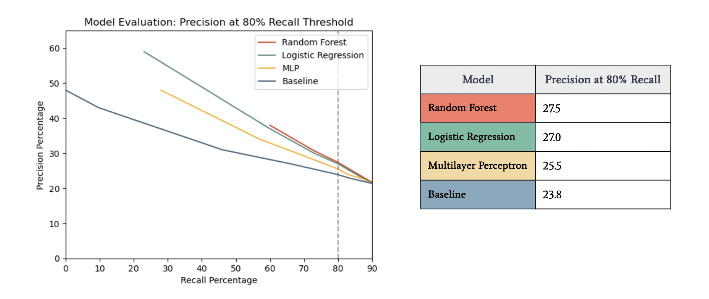

## Flight Delay Prediction at Scale 
 

### Overview
**Can we predict which flights will be delayed two hours before their scheduled departure times?**
 
This Machine Learning at Scale team project used Spark, Databricks, and 5 years of U.S. domestic flight and weather data to predict flight delays of at least 15 minutes at 2 hours in advance of their scheduled departures.
 
Our objectives in this project were to: 
1. Develop machine learning models that can predict 15+ minute delays within 2 hours of departure with at least 20% precision at 80% recall threshold 
2.  Identify key factors in flight delays for future model development and client insights
 
 

### Background
 
Optimization strategies for mitigating flight delays are crucial to the airline industry: timely flight performance is a key competitive factor, as high volumes of delayed flights increase operational costs and reduce customer satisfaction. On average, over 20% of U.S. flights are delayed by at least 15 minutes, translating to billions of dollars in costs for airlines [1]. At an estimated cost of $101.18 per minute of delay in aircraft block flight time, longer delays mean exacerbated costs [2]. Actionable predictions and insights into the sources of delays can empower proactive, data-driven strategies to minimize the disruptions caused by delays, yielding improved customer satisfaction and reduced operational costs.
 
 

### Data Overview
 
The flight dataset [3] we used was sourced from the TranStats data collection (U.S. Department of Transportation). The full dataset consists of on-time performance data for 31,746,841 U.S. passenger flights between 2015 and 2021, with 109 total features. Key features for use in EDA and modeling include flight and carrier (airline) identifiers, airport location information, and delay time and source attributes. 
 
Our weather dataset [4], sourced from NOAA (National Oceanic and Atmospheric Administration), consists of hourly, daily and monthly weather observation summaries.  Below is a table showing the general sections of features, some examples from each, and our understanding of those features.
 

 
It’s important to note that we performed a new join of flight and weather data to enhance the quality and precision of the data. Although this step was computationally intensive, doing so enabled us to achieve a number of important objectives not feasible with the existing version of the merged data:  
- Use more complete and granular weather features, especially same-day weather observations 
- Include arrival (destination) airport weather observations 
- Ensure weather features systematically reflect the most recent available data and prevent further issues with data leakage in subsequent feature engineering
 
 

 
 

### Data Preprocessing
Making the optimal use of the original data in our models required extensive data preprocessing and exploratory analysis, which is illustrated in the diagram below. 
 

 
 
#### Exploratory Data Analysis
Preliminary EDA of one year of joined flights and weather data (2015) revealed some striking trends that later proved largely consistent over the full data set. First, the distribution of flight delays based on length of delay, it was interesting to note that the majority of flights were early, on time, or delayed by fewer than 15 minutes. However, a small proportion of flights had extremely long delays (up to 3 hours, which preceded cancellations).
  
The frequency distribution of all domestic U.S. flights in 2015 (for all airports) is highly skewed, with a substantial proportion of early or on-time flights. Simple visualizations such as this point to the need to understand which characteristics are unique to the small proportion of flights with extremely long delay times.
 

 
We also noted the variation in average delay length by carrier, which subsequently informed our feature engineering decisions.
 

 
 
#### Feature Engineering
Experimentation with engineered features proved a critical part of improving model performance. The table below illustrates some of our key engineered predictors related to factors in delays identified in air transportation research, such as severe weather events and increased airport congestion. 
 

 
The plots below illustrate the relationships between the departure delay target variable and the engineered feature for previous delay for the same plane on the day of the flight. 
 

 
 
#### Feature Selection
Given the high dimensionality of the data and the imperative to guard compute efficiency, we used a number of methods to informed our feature selection decisions, including omitting features with over 90% null value and Lasso Regularization. Feature importance was also a consideration in developing our models. 
 

 
 
### Modeling Pipeline
The figure below provides an overview of our modeling pipeline. First, we devised a simple, intuitive baseline model computed as the mean delay at the flight’s origin airport between 4 and 2 hours prior to takeoff. We then built, trained, and evaluated logistic regression, random forest, and multilayer perceptron (MLP) models for comparison. 
 

 
 
#### Time Series Splits & Cross Validation
Preventing data leakage, or information from an evaluation dataset "leaking" into the training process, was a major challenge in designing our pipeline. By taking pains to exclude future information from predictions made for earlier time points, our objective was to prevent misleading or inflated performances in our models. We designed our pipeline with layers of evaluation data, including a cross-validation design suitable for time series data, to minimize potential data leakage.
 
1. The full, 5-year data was split into a training set (2015-2018) and test/holdout set (2019) to be used once for evaluation after finetuning the models. 
2. The 2015-2018 training set was then further split along an 80/20 ratio. The new reduced train set was used for the bulk of modeling and cross validation, while the 20% “pure” validation set was set aside for limited use in evaluation.  
3. All models were cross-validated using a sliding time-series split cross-validation design. The diagram below illustrates this technique.   

 
 
4. After building confidence in our cross-validated models, we evaluated them against our “pure” validation dataset.  
5. After iterating through the cross-validation and pure validation sets, we selected our final model pipeline and evaluated it against the test/holdout dataset.
 
 
The final image below integrates all stages of this approach: 
 

 
 
#### Scaling Considerations
Given the size of the data and our limited compute budget for the project, we also carefully tracked the efficiency of our models via their runtimes and configurations. Notably, the random forest model scaled the most effectively as we iterated from smaller subsets of training data to the full 4-year scope. 
 

 
 
#### Modeling Details: Multilayer Perceptron
To develop the multilayer perceptron model, we selected the subset of numeric features with at least moderate importance values across multiple rounds of the decision tree modeling and logistic regression as input. Following data preprocessing, we experimented with the four distinct network architectures detailed in the table below. 

| MLP Model | Architecture | Avg. CV Time | Avg. CV Train Recall | Avg. CV Train Precision |
| ------------ | ------------ | ------------ | ------------ | ------------ |
| 1 | 20 - 8 - Relu - 2 Softmax | 166.02s | 0.723 | 0.358 |
| 2 | 20 - 4 - Relu - 2 Softmax | 196.53s | 0.723 | 0.358 |
| 3 | 20 - 4 - Relu - 4 - Relu - 2 Softmax |  244.06s | 0.711 | 0.598 |
| 4 | 20 - 16 - Relu - 8 - Relu - 4 - Relu - 2 Softmax | 296.09s | 0.723 |

  
  
Ultimately, modifications to the network architectures translated only to minimal differences in average precision and recall values across the cross-validated sets. Architecture 3 (20 - 4 - Relu - 4 - Relu - 2 Softmax) was selected as our final MLP model on the basis of its marginally lower disparities between precision and recall for the validation sets against the train sets in cross validation as well as its lighter compute time compared to the more complex Architecture 4. 
 

 
 
### Model Evaluation 
#### Performance Metric 
To evaluate model performance, we chose to measure precision at a threshold of 80% recall to reflect the relative higher cost of false negative delay predictions. This prioritizing of recall enabled us to ensure that the insights we produce would be actionable in responding to flight delay mitigation. We therefore thresholded our predictions such that the resulting recall is approximately 80%, and models are evaluated based on associated precision value at that threshold. 
 
 
#### Results

 
With a precision value of 27.5% at 80% recall, the random forest model slightly outperformed the logistic regression, MLP, and baseline models. In other words, this performance metric means that (1) given that we are correctly classifying at least 80% of true delays overall, (2) we are also correctly classifying 27.5% of the true delays as delays (and conversely, 72.5% of non-delays as delays). 
 
 
We also subsequently developed an ensemble model combining the logistic regression, random forest, and MLP predictions using majority voting with weighted votes. This pipeline was a result of fine-tuning the hyperparameters within each respective model, such as numTrees and maxDepth in Random Forest, and included engineered features (e.g. average delay at the origin airport, hourly precipitation, etc.). This final model ultimately outperformed the previous models, with marginal improvement. 
 
 
#### Results Analysis 
The graph below shows the distributions of model results for the subsets of delayed and on time predictions. Notably, longer delays indicate higher chances of being predicted as delayed. This demonstrates that the model does detect some important patterns predictive of a delay. In fact, for flights with the delay significantly above 15, the majority are labeled as delayed. 
 

 
Given those distinctions, it's possible that adjusting the delay threshold to a more moderate 30 minutes or even taking a multi-class classifiation approach multi would help with performance. On the other hand, many flights departing ahead of schedule are also labeled "delayed" by the model. This might be an indication that the model finds flights that are unusual in general, rather than flights that are specifically delayed.
 
 
### Conclusion 
Proactive delay management through predictive analytics translates to enhanced operational efficiency. Our analysis enables airlines to effectively identify flights with high probabilities of delay and facilitate more optimal crew scheduling, lower fuel wastage, and lessened customer compensation for delays, thus mitigating inefficiencies that lead to negative financial impact.
 
 
We recommend integrating this predictive model into operational strategies for delay management. Continuous monitoring and refinement of the model promise sustained improvements in operational efficiency and customer satisfaction over time.
 
